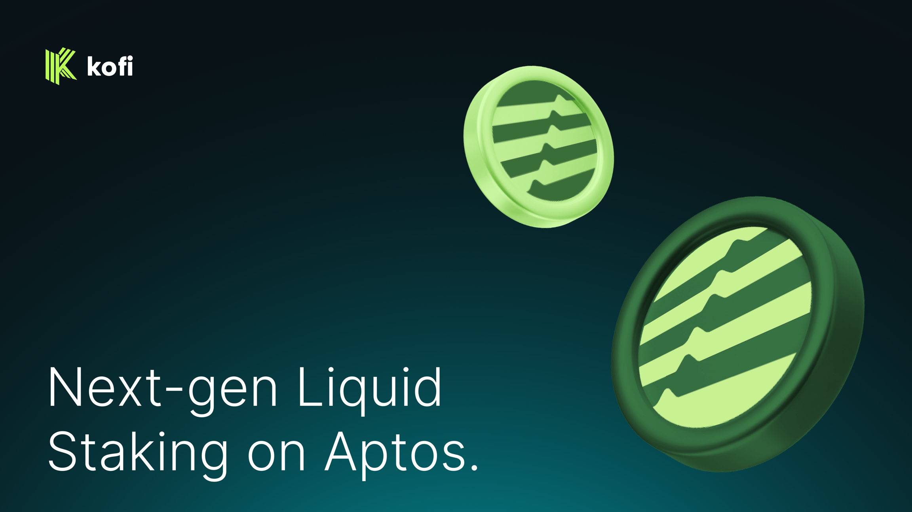

# ☕ Introduction to Kofi

# Kofi – Aptos first liquid staking token offering boosted yields

Kofi is a next-generation liquid staking platform on Aptos, allowing Aptos users to earn boosted staking rewards through Kofi's **dual liquid staking token model** — kAPT & stkAPT.

Kofi offers **boosted liquid staking**, whereby Kofi's yield bearing staked asset provides staking yields as the base layer yield with additional boosted rewards accrued on top of it.  

## Breaking down Kofi's dual liquid staking token model

### kAPT

Kofi's 1:1 pegged liquid staked token ("LST"), designed to remain pegged with APT and always redeemable for the underlying staked APT.  

- Can be held in your wallet or further utilised across Aptos DeFi

### stkAPT

"Staked kAPT" provides base staking reward yields plus additional boosted yields on top of the base APT staking rewards. stkAPT boosted yields are accurued via innovative methods of capturing yields on Aptos.

- Can be held in your wallet or further utilised across Aptos DeFi

## Core Features

- **Liquid Staking**: Stake APT and receive kAPT tokens
- **Boosted Yields**: Earn additional rewards through stkAPT
- **Composability**: Use kAPT tokens across the DeFi ecosystem
- **Security**: Audited smart contracts and robust security measures

## Official Links

- Website: [https://kofi.finance](https://kofi.finance)
- Twitter: [https://x.com/kofi_finance](https://x.com/kofi_finance)
- Discord: [https://discord.gg/kofi](https://discord.gg/kofi_finance)
- App: [https://app.kofi.finance](https://app.kofi.finance)
