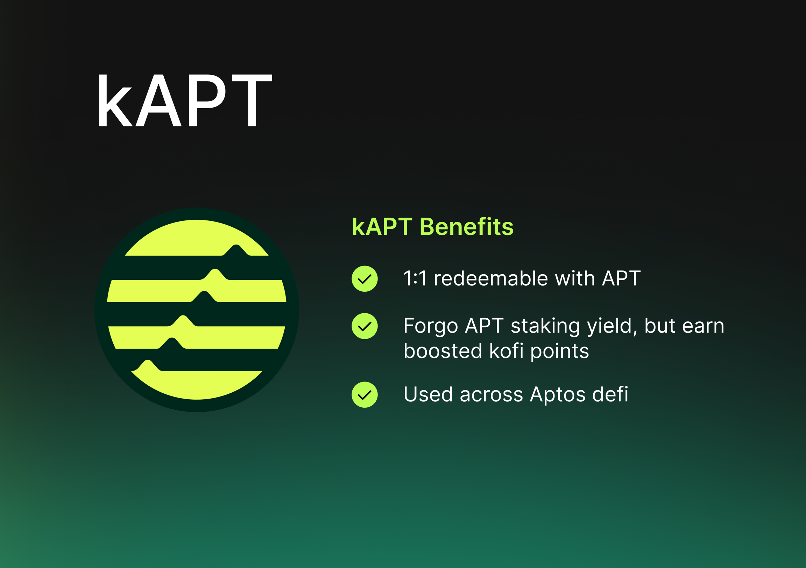
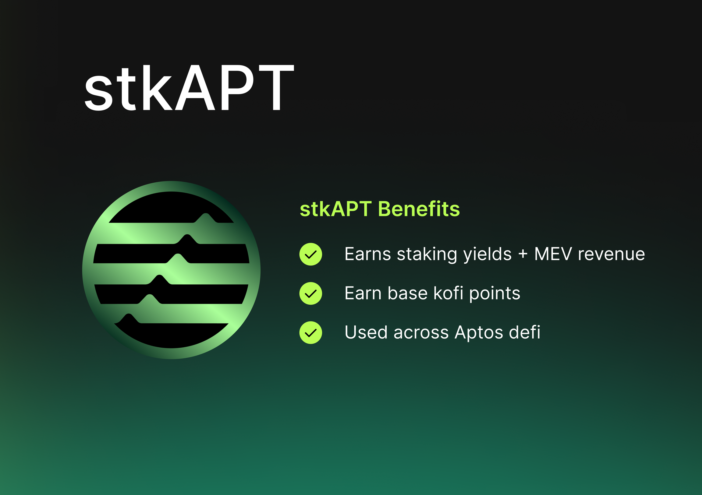

# kAPT & stkAPT

## kAPT — "Kofi APT" 1:1 pegged to APT

kAPT ("Kofi APT") directly represents your staked APT, pegged at 1:1. kAPT is a liquid staking token you receive when staking APT on Kofi. It is pegged 1:1 with APT and represents your staked APT within the Kofi platform, which means 1 kAPT can always be redeemed for 1 APT.

### Utility of kAPT

- 1:1 pegged to APT — 1 kAPT redeemable for 1 APT
- Tradeable across Aptos DEXs and Aggregators
- Usable across Aptos money markets as a collateral asset
- Usable across Aptos DEXs to trade or provide liquidity

### Withdrawing kAPT -> APT

**Normal Unstaking**: 14 days, based on Aptos underlying 14 days unstaking lockup duration.

**Instant Unstaking**: Instantly via swapping on our DEX partners

## stkAPT — Staked kAPT to earn staking yields + boosted rewards

kAPT can be further staked to stkAPT ("Staked kAPT"), a yield bearing asset.

The base value of stkAPT (relative to kAPT) increases over time through accruing staking rewards. It is also a more capital efficient form of APT as you are earning yield while holding the token, and can be used as collateral within Aptos DeFi. stkAPT boosted rewards are accrued via additional innovative methods of capturing yields on Aptos.

The amount of kAPT redeemable by 1 stkAPT grows daily, thanks to the compounding effect of staking rewards. For instance, if 1 stkAPT equal to 1 kAPT on day 1 and the staking APR is 7%, 1 stkAPT will be worth at least 1.07 kAPT after one year. This daily appreciation means stkAPT consistently becomes more valuable in terms of kAPT. Users can claim these rewards either by unstaking their stkAPT or trading it through our DEX partners on Aptos.

### Utility of stkAPT

- Yield-bearing asset, accruing staking yields + boosted rewards
- Tradeable across Aptos DEXs and Aggregators
- Usable across Aptos money markets as a collateral asset
- Usable across Aptos DEXs to trade or provide liquidity

### Unstaking stkAPT -> APT

Unstaking stkAPT to kAPT is instant

## kAPT & stkAPT Price / Exchange Rate

It's important to understand that while both kAPT & stkAPT has a true price ("Exchange Rate") guaranteed by our protocol, both of their prices may vary on DEXs and exchanges if the liquidity pools become unbalanced.

Such price discrepancies are typically resolved quickly through arbitrage. However, we encourage users to compare the price of kAPT and stkAPT on DEXs with their prices on Kofi to ensure you are getting the best value for your trades.

- **kAPT & stkAPT Price**: Price of kAPT & stkAPT within the liquidity pool of our DEX Partners
- **kAPT & stkAPT Exchange Rate**: The guaranteed no-slippage true price of kAPT & stkAPT upon redemption via Kofi

## stkAPT APR Calculation

### Aptos Base Staking APR

The main source of APR for liquid staking tokens (LSTs) on Aptos, like Kofi's kAPT, comes from staking rewards generated by the Aptos network. These rewards are influenced by factors such as the total APT staked, the network's inflation rate, and the performance of validators. On Aptos, staking rewards primarily stem from transaction fees and token issuance via inflation. At present, the base staking APR stands at 7%.

### Kofi Boosted Yields APR

Kofi will be introducing proprietary boosted yields to enhance the APR received by APT stakers on Aptos. This will be added on top of the 7% APR.

### Validator Performance

On the Aptos network, validator performance is crucial in determining the APR for liquid staking tokens. Validators who consistently validate transactions successfully and maintain network security without downtime or penalties are rewarded with higher staking rewards. In contrast, underperforming validators may incur penalties or slashing, which can lower the overall staking rewards.

### Commission Fees

Validators on Aptos typically charge a commission on the rewards generated from staking. The APR for stakers is affected by the commission rates set by the validators. When the commission percentage is lower, it results in higher APRs for users staking through Kofi.

### Protocol Fees

Kofi might impose a fee for its liquid staking services, which can influence the APR for LST holders. This fee is currently set at 0%.

## kAPT & stkAPT Use Cases

Apart from holding kAPT & stkAPT, you can also use it within the DeFi ecosystem, all while its value steadily increases relative to your staked APT. Find out more in [kAPT & stkAPT DeFi Use Cases](/liquid-staking/defi-use-cases).
