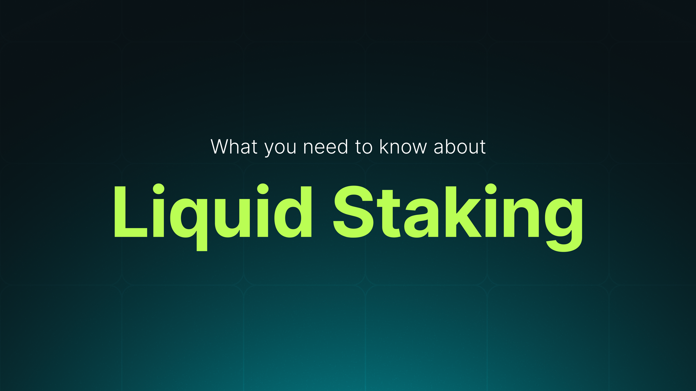

# Liquid Staking

**The most capital efficient way to earn rewards on APT**

## What is Liquid Staking?

Liquid staking allows users to stake their tokens without sacrificing liquidity. This is achieved through the creation of liquid staking tokens, which are on-chain representations of staked assets and serve as claims on the underlying staking positions.

Liquid staking works similarly to traditional staking. The value of your liquid staked assets increases through staking rewards, making it a straightforward staking tool rather than a speculative asset. It is also a more capital efficient form of APT as you are earning yield while holding the token.

## Kofi's Dual Token Model

### kAPT — "Kofi APT" 1:1 pegged to APT

kAPT ("Kofi APT") directly represents your staked APT, pegged at 1:1. Think of kAPT as a proof-of-stake token that remains liquid and functional within the Aptos ecosystem.

### stkAPT — Staked kAPT to earn staking yields + boosted rewards

kAPT can be further staked to stkAPT ("Staked kAPT"), a yield bearing asset.

The base value of stkAPT (relative to kAPT) increases over time through staking rewards, making it a straightforward staking asset rather than a speculative one. It is also a more capital efficient form of APT as you are earning yield while holding the token, and can be used as collateral within Aptos DeFi.

stkAPT boosted rewards are accrued via innovative methods of capturing yields on Aptos.

## Why is Liquid Staking APT Important?

Liquid staking addresses several key challenges on Aptos:

### Capital Efficiency

Liquid staking tokens empower users to earn staking rewards while simultaneously participating in DeFi. This eliminates the need to choose between staking APT or using your APT liquidity in AMMs, lending protocols, and other DeFi platforms on Aptos. With liquid staking through Kofi, you can stake APT to receive kAPT and use kAPT to earn both staking rewards and DeFi yields – double dip all the yields to the maximum potential!

### Skip 14 days Unstaking Period

Liquid staking tokens can be instantly exchanged for the underlying staked assets via swapping it on Aptos DEXs, bypassing the standard 14 days unstaking period on Aptos. This provides users with immediate access to their funds whenever needed.

### Supporting Network Decentralisation & Validator Diversification

Liquid staking reduces reliance on a single validator by allowing users to spread their stake across multiple validators. This diversification lowers risk and acts as insurance against potential slashing events due to poor performance by any single validator. Do note that there is currently no slashing on Aptos.

## Liquid Staking via Kofi

Kofi is a next-gen liquid staking solution on Aptos:

- **Seamless UIUX:** Enables you to stake on a seamless user interface with top-notch user experience for you to easily manage your staked positions

- **Boosted Yields:** Kofi stkAPT advantage lies in its boosted yields as compared to other Aptos LSTs

- **DeFi Opportunities:** Kofi kAPT & stkAPT will be highly composable across multiple DeFi protocols on Aptos
