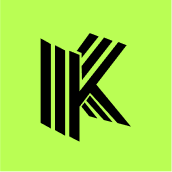

# Brand Assets

## Introduction

The Kofi Finance brand represents our commitment to innovation, security, and user-centric design in the liquid staking space. This guide provides official brand assets and guidelines to ensure consistent representation of Kofi Finance across all platforms and materials.

## Brand Colors

### Primary Palette

| Color | Hex | RGB | Preview | Usage |
|-------|-----|-----|---------|-------|
| Kofi Green | #BAFE54 | rgb(186, 254, 84) | 

 | Primary brand color, CTAs, highlights |
| White | #FFFFFF | rgb(255, 255, 255) | 

 | Light backgrounds, text on dark surfaces |
| Black | #131313 | rgb(19, 19, 19) | 

 | Dark backgrounds, text on light surfaces |

### Extended Palette

| Color | Hex | RGB | Preview | Usage |
|-------|-----|-----|---------|-------|
| Lime Green | #72BE00 | rgb(114, 190, 0) | 

 | Secondary accents, success states |
| Nude Green | #05666F | rgb(5, 102, 111) | 

 | Tertiary elements, depth creation |
| Dark Green | #00271C | rgb(0, 39, 28) | 

 | Deep backgrounds, contrast elements |
| Gray | #8D8F8F | rgb(141, 143, 143) | 

 | Secondary text, disabled states |
| Dark Gray | #0A0A0A | rgb(10, 10, 10) | 

 | Alternative dark backgrounds |

## Logo

Our logo represents the Kofi Finance brand and should be used consistently across all materials. Always use the official logo files provided below.

### Primary Logo

**White version** - For use on dark backgrounds  
[Download SVG](../assets/kofi-logo-white.svg)

**Black version** - For use on light backgrounds  
[Download SVG](../assets/kofi-logo-black.svg)

### Symbol

**Symbol only** - For use in space-constrained contexts  
[Download SVG](../assets/kofi-symbol.svg)

## Logo Variations

### Square Format

  

    
    
<a href="../assets/kofi-green-square.png">Green Square</a>

  

  

    
    
<a href="../assets/kofi-black-square.png">Black Square</a>

  

### Rounded Format

  

    
    
<a href="../assets/kofi-green-rounded.png">Green Rounded</a>

  

  

    
    
<a href="../assets/kofi-black-rounded.png">Black Rounded</a>

  

### Circle Format

  

    
    
<a href="../assets/kofi-green-circle.png">Green Circle</a>

  

  

    
    
<a href="../assets/kofi-black-circle.png">Black Circle</a>

  

## Decorative Elements

### Blob Shapes

These organic shapes can be used as decorative elements in marketing materials and website backgrounds.

  

    
    
<a href="../assets/kofi-blob-1.png">Blob 1</a>

  

  

    
    
<a href="../assets/kofi-blob-2.png">Blob 2</a>

  

  

    
    
<a href="../assets/kofi-blob-3.png">Blob 3</a>

  

  

    
    
<a href="../assets/kofi-blob-4.png">Blob 4</a>

  

  

    
    
<a href="../assets/kofi-blob-5.png">Blob 5</a>

  

### Do's and Don'ts

✅ **Do**:

- Use official logo files without modification
- Follow the color palette guidelines
- Maintain clear space around the logo
- Use typography consistently

❌ **Don't**:

- Modify or distort the logo
- Use unapproved color combinations
- Place the logo on low-contrast backgrounds
- Use the Kofi name or logo to imply partnership without permission

## Contact

For questions about brand usage or to request additional assets, please contact [wagmitt@kofi.finance]
